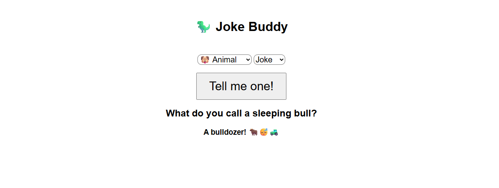
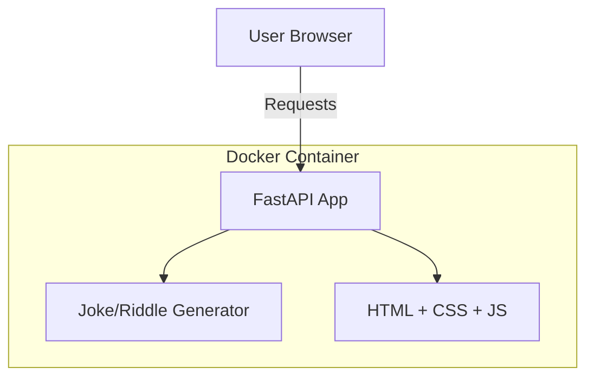

# RiddleBuddy 🎉

Simple, kid-friendly joke & riddle web app built with **FastAPI**.  
Portfolio project to demonstrate DevOps practices: Docker, CI/CD, Kubernetes, IaC, monitoring.

[](https://www.python.org/)
[](https://fastapi.tiangolo.com/)
[](https://www.docker.com/)

Live Demo: (coming soon - deploying to Railway)  
GitHub Actions CI: (badge will appear after pipeline setup)

## 📸 Screenshot



## Architecture

Simple monolith: FastAPI serves both API and static HTML/JS frontend.




## Tech stack 
- Backend & API: FastAPI (Python)  
- Frontend: Basic HTML + CSS + Vanilla JS  
- Containerization: Docker  
- Future: GitHub Actions, Kubernetes (kind/minikube), Terraform (DigitalOcean/GCP), Prometheus + Grafana  

## Quick Start (Local)
```bash
# Clone repo
git clone https://github.com/yourusername/riddlebuddy.git
cd riddlebuddy/app

# Build & run with Docker
docker build -t riddlebuddy .
docker run -p 8080:8080 -e DEEPSEEK_API_KEY={your-api-key} riddlebuddy:latest

# Open browser: http://localhost:8080
```


