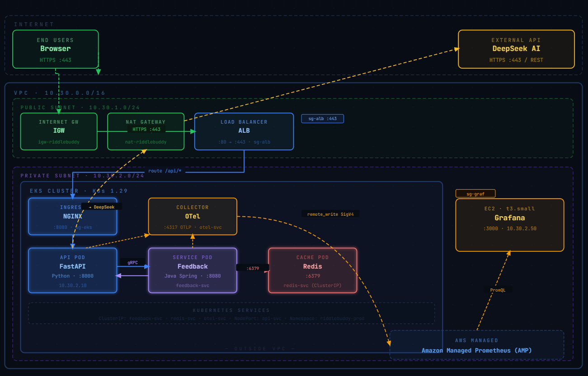

# RiddleBuddy 🎲

> AI-powered riddle app — a full DevOps showcase built on Kubernetes, AWS EKS, and OpenTelemetry.

[](https://www.python.org/)
[](https://fastapi.tiangolo.com/)
[](https://www.docker.com/)
[](https://kubernetes.io/)
[](https://www.terraform.io/)
[](https://github.com/tuna6/RiddleBuddy/actions)

**Live Demo:** [riddlebuddy.nguyentu.online](https://riddlebuddy.nguyentu.online)

---

## What is this?

RiddleBuddy started as a simple joke app and evolved into a complete DevOps portfolio project. It generates AI-powered riddles via the DeepSeek API and demonstrates real-world practices across containerization, Kubernetes orchestration, infrastructure-as-code, CI/CD, and full observability.

---

## Architecture

> Full cloud architecture diagram: [nguyentu.online/#projects](https://nguyentu.online/#projects)



**Services:**
| Service | Tech | Description |
|---|---|---|
| `riddlebuddy-api` | FastAPI · Python | Core API, riddle generation via DeepSeek |
| `riddlebuddy-feedback` | Java Spring · :8080 | User feedback collection |
| `redis` | Redis · :6379 | Response caching |
| `otel-collector` | OpenTelemetry | Metrics, logs & traces aggregation |
| `grafana` | Grafana · EC2 | Dashboards & alerting |

---

## Tech Stack

| Layer | Tools |
|---|---|
| Cloud | AWS (EKS, VPC, ALB, EC2, AMP, Route53, ACM, CloudWatch Logs) |
| Containers | Kubernetes · Docker · Helm |
| IaC | Terraform |
| Observability | OpenTelemetry · Prometheus (AMP) · Grafana · Loki · Fluent-bit |
| CI/CD | GitHub Actions · ArgoCD |
| Backend | FastAPI (Python) · Java Spring |
| Frontend | HTML · CSS · Vanilla JS |

---

## CI/CD Pipeline

Every push to `main` that touches `services/**` triggers the following pipeline:
```
git push
  └── helm lint                        # validate chart before anything runs
  └── detect changes (api / feedback)
        └── docker build
              └── trivy scan           # block on HIGH/CRITICAL CVEs
                    └── push to ECR
                          └── update values.yaml (git sha tag)
                                └── ArgoCD sync → EKS
                                      └── health check (rollout status)
```

**Quality gates:**

| Gate | Tool | Blocks on |
|---|---|---|
| Pre-commit lint | Ruff · Prettier | Style, unused imports, formatting |
| Secret scanning | Gitleaks | Leaked API keys or credentials |
| Chart validation | Helm lint | Broken chart templates |
| Vulnerability scan | Trivy | HIGH / CRITICAL CVEs in images |
| GitOps deploy | ArgoCD | Auto-sync, self-heal, rollback on failure |

---

## Deployment Options

| Mode | Description | Guide |
|---|---|---|
| 🖥️ **Local** | Full stack on your machine via k3s + Helm | [docs/deploy-local.md](docs/deploy-local.md) |
| ☁️ **Hybrid AWS** | App on k3s, monitoring on AWS (AMP) | [docs/deploy-hybrid.md](docs/deploy-hybrid.md) |
| 🚀 **Full AWS** | Everything on EKS + AWS managed services | [docs/deploy-aws.md](docs/deploy-aws.md) |

---

## Quick Start (Local)

**Prerequisites:** Docker, k3s, kubectl, helm
```bash
git clone https://github.com/tuna6/RiddleBuddy.git
cd RiddleBuddy

export DEEPSEEK_API_KEY=your_key_here
chmod +x deploy-local-full.sh
./deploy-local-full.sh
```

| Service | URL |
|---|---|
| App | http://localhost:30080/static |
| Grafana | http://localhost:3000 |

---

## What this project demonstrates

- **Kubernetes** — multi-service deployment with Helm, namespaces, ClusterIP/NodePort services
- **AWS EKS** — production-grade cluster with ALB ingress, NAT gateway, private subnets
- **Observability** — end-to-end with OpenTelemetry: metrics → AMP, logs → Loki, traces → Grafana
- **IaC** — full AWS infrastructure defined in Terraform
- **CI/CD** — GitHub Actions pipeline with change detection, Docker build, Trivy security scan, ECR push
- **GitOps** — ArgoCD for auto-sync, self-heal, and rollback on failed deploys
- **Security** — Trivy image scanning, Gitleaks secret detection, pre-commit hooks, private subnet isolation, IRSA for pod-level AWS permissions

---

## Repository Structure
```
RiddleBuddy/
├── services/
│   ├── api/               # FastAPI service
│   └── feedback-service/  # Java Spring service
├── helm/                  # Helm charts
├── argocd/                # ArgoCD config
├── infra-cloud/           # Terraform (hybrid + full AWS)
├── .github/workflows/     # CI/CD pipelines
├── .pre-commit-config.yaml
└── docs/                  # Deployment guides & diagrams
```

---

## License

Apache 2.0 — contributions, feedback, or roasts welcome. 😄